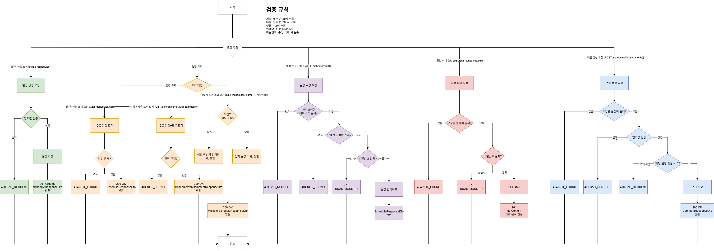

# Spring Boot 기반 일정 관리 프로젝트


Spring Boot 기반 일정 관리 프로젝트입니다. 3 Layer Architecture 구조로 설계되었으며, JPA를 활용한 CRUD 기능과 비밀번호 인증 로직을 구현했습니다.

---


## 📌 프로젝트 개요

- Controller-Service-Repository로 구성된 **3 Layer Architecture** 적용
- JPA + MySQL DB를 통해 CRUD 기능 구현
- **일정 수정/삭제 시 비밀번호 검증 로직** 포함
- 응답에서 비밀번호는 항상 제외
- JPA Auditing으로 `작성일/수정일` 자동 처리

---

## ✅ 주요 기능

- **일정 생성**  
  제목, 내용, 작성자명, 비밀번호 입력 → 일정 등록

- **일정 조회**  
  전체 조회 (작성자명 조건 optional), 단건 조회 (ID 기반)

- **일정 수정/삭제**  
  비밀번호 일치 시에만 허용

- **모든 API 응답에서 비밀번호 제외**

---

## 🧩 도전 기능

- 댓글 등록 (일정당 최대 10개)
- 일정 단건 조회 시 댓글 포함 응답
- 입력값 유효성 검사  
  (제목 30자, 내용 200자, 댓글 100자 제한 등)

---

## 🛠 사용 기술 및 도구

- **Language**: Java 17
- **Framework**: Spring Boot
- **Build Tool**: Gradle
- **IDE**: IntelliJ IDEA
- **Version Control**: Git

---

## 📁 디렉토리 구조

````
com.example.spartascheduler
├── controller                # 요청을 처리하는 웹 계층 (REST API 진입점)
│   ├── CommentController         # 댓글 관련 요청 처리
│   └── ScheduleController        # 일정 관련 요청 처리
│
├── dto                      # 요청/응답 데이터 전송 객체 (DTO)
│   ├── comment
│   │   ├── CommentRequestDto     # 댓글 생성 요청 DTO
│   │   └── CommentResponseDto    # 댓글 응답 DTO
│   └── schedule
│       ├── ScheduleRequestDto    # 일정 생성/수정 요청 DTO
│       ├── ScheduleResponseDto   # 일정 응답 DTO
│       └── ScheduleWithCommentsResponseDto  # 일정 + 댓글 응답 DTO
│
├── entity                   # JPA 엔티티 클래스 (DB 테이블 매핑)
│   ├── BaseEntity               # 공통 필드 (생성일, 수정일 등) 추상 클래스
│   ├── Comment                  # 댓글 엔티티
│   └── Schedule                 # 일정 엔티티
│
├── repository              # 데이터베이스 접근 계층
│   ├── CommentRepository       # 댓글 JPA 레포지토리
│   └── ScheduleRepository      # 일정 JPA 레포지토리
│
├── service                 # 비즈니스 로직 계층
│   ├── CommentService          # 댓글 관련 로직 처리
│   └── ScheduleService         # 일정 관련 로직 처리
│
└── SpartaSchedulerApplication  # 스프링부트 애플리케이션 시작 클래스
````

---

## 🎯 핵심 학습 포인트

- 3 Layer Architecture의 역할 분리를 통해 유지보수성과 테스트 용이성 학습
- JPA Auditing을 통한 자동 시간 관리 적용
- REST API 응답 설계 시, 보안(비밀번호 제외) 고려
- 일정 수정/삭제 시 인증 로직 구현 (비밀번호 일치 검증)
- 마크다운 문서 구성 및 ERD 작성 경험


---

## 📄 API 명세 요약

| 기능 구분 | 메서드 | 엔드포인트 | 설명 |
|-----------|--------|-------------|------|
| 일정 생성 | POST   | `/schedules` | 일정 등록 |
| 전체 조회 | GET    | `/schedules` | 작성자명 필터 optional |
| 단건 조회 | GET    | `/schedules/{id}` | 특정 일정 조회 |
| 일정 수정 | PATCH  | `/schedules/{id}` | 제목/작성자 수정 (비밀번호 필요) |
| 일정 삭제 | DELETE | `/schedules/{id}` | 일정 삭제 (비밀번호 필요) |
| 댓글 작성 | POST   | `/schedules/{id}/comments` | 특정 일정에 댓글 작성 |
| 일정 + 댓글 조회 | GET | `/schedules/{id}/with-comments` | 일정 및 댓글 함께 조회 |

📘 **[👉 전체 API 명세 보기](./docs/api.md)**

---

## 📄 ERD


---

## 📄 API Flow Chart


---

## 🙌 기여자
| 이름 | 역할 |
|------|------|
| **@soo** | 개발 및 설계, 문서 작성 |

---
## 📅 개발 기간
2025.07.31 ~ 2025.08.01 (총 2일)

---

## 📒 개발 기록 (TIL)

- [2025.07.31 - 일정 관리 앱 과제 설정](https://velog.io/@sooh59599/2025.07.31-TIL-%EC%9D%BC%EC%A0%95-%EA%B4%80%EB%A6%AC%EC%95%B1-%EA%B3%BC%EC%A0%9C-%EC%84%A4%EC%A0%95)
- [2025.08.01 - Lv5 댓글 생성 구현](https://velog.io/@sooh59599/2025.08.01-TIL-lv5-%EB%8C%93%EA%B8%80-%EC%83%9D%EC%84%B1-%EA%B5%AC%ED%98%84)
- [2025.08.01 - Lv6 일정 단건 조회 업그레이드](https://velog.io/@sooh59599/2025.08.01-TIL-lv6-%EC%9D%BC%EC%A0%95-%EB%8B%A8%EA%B1%B4-%EC%A1%B0%ED%9A%8C-%EC%97%85%EA%B7%B8%EB%A0%88%EC%9D%B4%EB%93%9C-%EA%B5%AC%ED%98%84)
- [2025.08.01 - Lv7 유저 입력 검증 수행](https://velog.io/@sooh59599/2025.08.01-TIL-lv7-%EC%9C%A0%EC%A0%80%EC%9D%98-%EC%9E%85%EB%A0%A5%EC%97%90-%EB%8C%80%ED%95%9C-%EA%B2%80%EC%A6%9D-%EC%88%98%ED%96%89)

### 🐞 트러블슈팅

- [2025.07.31 - 트러블슈팅 정리](https://velog.io/@sooh59599/2025.07.31-TIL-%ED%8A%B8%EB%9F%AC%EB%B8%94%EC%8A%88%ED%8C%85)
- [2025.08.01 - 클래스 이름 중복 문제 해결](https://velog.io/@sooh59599/2025.08.01-TIL-%ED%81%B4%EB%9E%98%EC%8A%A4-%EC%9D%B4%EB%A6%84%EA%B3%BC-%EA%B0%99%EC%9D%80-%ED%95%84%EB%93%9C%EB%AA%85)
